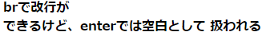
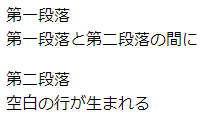
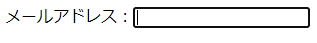
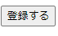

# HTML

# TASK

- 定型文のところ
- 

## 定型文

```html
<!DOCTYPE html> 
<html>
<head>
    <meta charset="UTF-8">
    <meta name="viewport" content="width=device-width">
    <title>ログイン</title>
</head>
<body>

</body>
</html>
```

### 解説(<>は省略)

- !DOCTYPE：HTMLの標準仕様に準拠したページを表示させる標準モードにするために必要。
- html：DOCTYPE宣言の後は必ずこれを記す必要がある。

## 見だしタグ

###  記法

```html
<h1></h1>
<h2></h2>
<h3></h3>
<h4></h4>
<h5></h5>
<h6></h6>
```

### 使用例

```html
<h1>
    h1タグ
    <h2>
        h2タグ
        <h3>
            h3タグ
            <h4>
                h4タグ
                <h5>
                    h5タグ
                    <h6>
                        h6タグ
                        <h7>
                            h7タグは使えない
                        </h7>
                    </h6>
                </h5>
            </h4>
        </h3>
    </h2>
</h1>
```

### 参考画像


## 改行タグ

### 記法

```html
<br>
```

### 使用例

```html
<h4>
    brで改行が<br>
    できるけど、enterでは空白として
    扱われる
</h4>
```

### 参考画像



## 段落(paragraph)タグ

### 記法

```html
<p></p>
```

### 使用例

```html
<p>
    第一段落<br>
    第一段落と第二段落の間に
</p>
<p>
    第二段落<br>
    空白の行が生まれる
</p>
```

### 参考画像



## input要素

### 記法

```html
<input 属性名1="属性値1" 属性名2="属性値2"…>
```

### 使用例

```html
<p>メールアドレス：<input type="email" name="mymail"></p>
```

### 参考画像



### inputのtype属性

#### 属性値

- email：メールアドレスの入力のみ許可します
- password：入力された内容を●で隠す

### name属性

- 入力フォームに名前を付ける。JSやWeb鯖との連携で利用される。
- 属性値は自由に決められそう

### value属性

- すでにあらかじめ例として入力された状態のフォームができる。
- 当然自由に設定できそう

## button要素

### 記法

```html
<button type="ボタンタイプ">ラベル</button>
```

### 使用例

```html
<p><button type="submit">登録する</button></p>
```

### 参考画像



### buttonのtype属性

#### 属性値

- submit：送信ボタン。これを押すとフォーム送信される。
- reset：入力した内容をクリアする。
- button JSと組み合わせて利用。


## 

### 記法

```html

```

### 使用例

```html

```

### 参考画像

