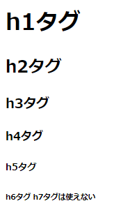
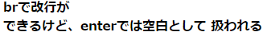
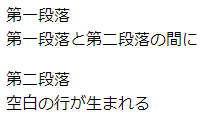
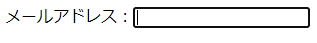

# HTML

## 見だしタグ

###  記法

```html
<h1></h1>
<h2></h2>
<h3></h3>
<h4></h4>
<h5></h5>
<h6></h6>
```

### 使用例

```html
<h1>
    h1タグ
    <h2>
        h2タグ
        <h3>
            h3タグ
            <h4>
                h4タグ
                <h5>
                    h5タグ
                    <h6>
                        h6タグ
                        <h7>
                            h7タグは使えない
                        </h7>
                    </h6>
                </h5>
            </h4>
        </h3>
    </h2>
</h1>
```

### 参考画像


## 改行タグ

### 記法

```html
<br>
```

### 使用例

```html
<h4>
    brで改行が<br>
    できるけど、enterでは空白として
    扱われる
</h4>
```

### 参考画像



## 段落(paragraph)タグ

### 記法

```html
<p></p>
```

### 使用例

```html
<p>
    第一段落<br>
    第一段落と第二段落の間に
</p>
<p>
    第二段落<br>
    空白の行が生まれる
</p>
```

### 参考画像



## input要素

### 記法

```html
<input 属性名1="属性値1" 属性名2="属性値2"…>
```

### 使用例

```html
<p>メールアドレス：<input type="email" name="mymail"></p>
```

### 参考画像

